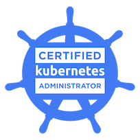

<!--
**nianjiang/nianjiang** is a ✨ _special_ ✨ repository because its `README.md` (this file) appears on your GitHub profile.

Here are some ideas to get you started:

- 🔭 I’m currently working on ...
- 🌱 I’m currently learning ...
- 👯 I’m looking to collaborate on ...
- 🤔 I’m looking for help with ...
- 💬 Ask me about ...
- 📫 How to reach me: ...
- 😄 Pronouns: ...
- ⚡ Fun fact: ...
-->

Hello :wave: :wave:

...

Links:

[Github.io](https://nianjiang.github.io/),  [Gitee.io](https://jnh.gitee.io/)

[GithubWiki](https://github.com/nianjiang/nianjiang.github.io/wiki)

[Gists](https://gist.github.com/nianjiang)

[CKA](https://www.credly.com/badges/e117b668-5030-4e55-9b35-e51ef36ae922/public_url)

